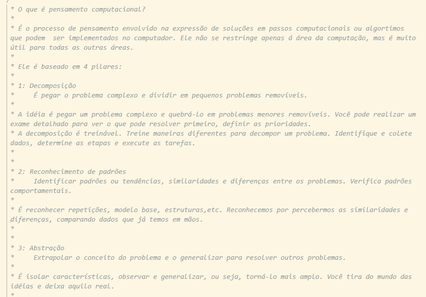
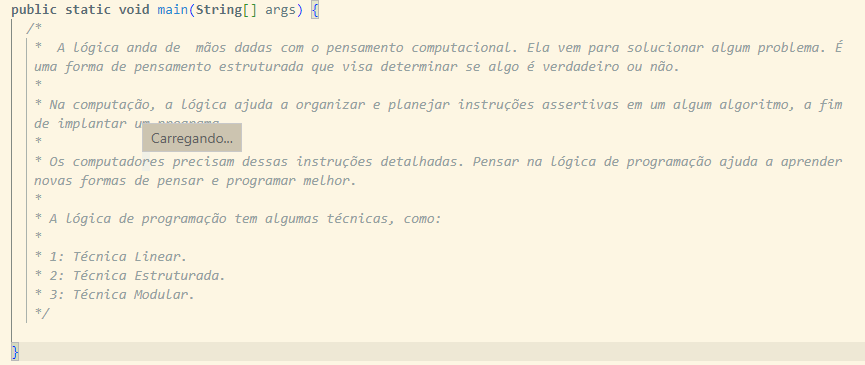
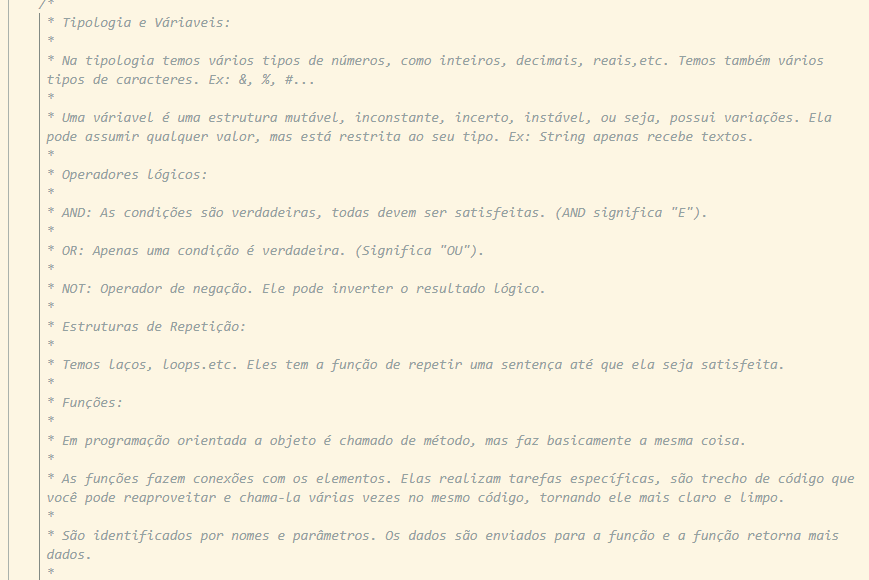

<h1 align="center"> Bem vindo(a) ao Anotações.com.br </h1>

 

:construction: Projeto em construção :construction:

# :hammer: Funcionalidades do projeto

- `Funcionalidade 1`: Forma simples de consultar alguns termos, além de conter um exemplo prático visto em aula.
- `Funcionalidade 2`: Serve como um diário que pode sempre ser visto por qualquer pessoa.

# 📁 Acesso ao projeto

**Você pode acessar o Anotações.com.br por meio do GitHub pages que está ativo, ele se encontra do lado direito da sua tela. Vale lembrar que ele está em construção e por conta da responsividade, recomendamos você acessar por um desktop para melhor visualização.**

# 🛠️ Problemas ao abrir o projeto

**Caso você não consiga abrir o site ou visualizá-lo, vou deixar aqui embaixo um print com todas as informações para que você não deixe de ver nosso conteúdo.**

# :eyes: Prints com as informações
**:white_check_mark: Pensamento Computacional**

**:white_check_mark: Lógica de Programação**

**:white_check_mark: Fundamentos e Algoritmos**

# :computer: Tecnologias Utilizadas
  

**Se você gostou desse projeto, classifica ele para mim com as :star2:, e se ficou com alguma dúvida, pode se sentir a vontade para me contatar.**

